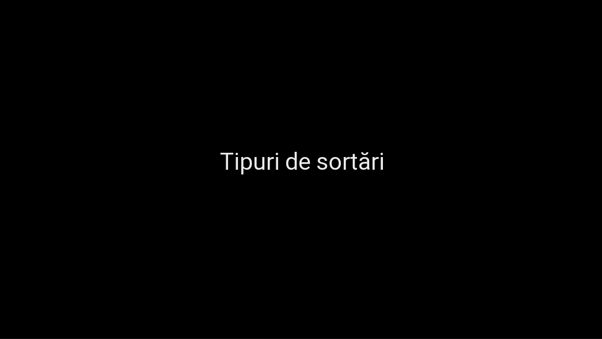
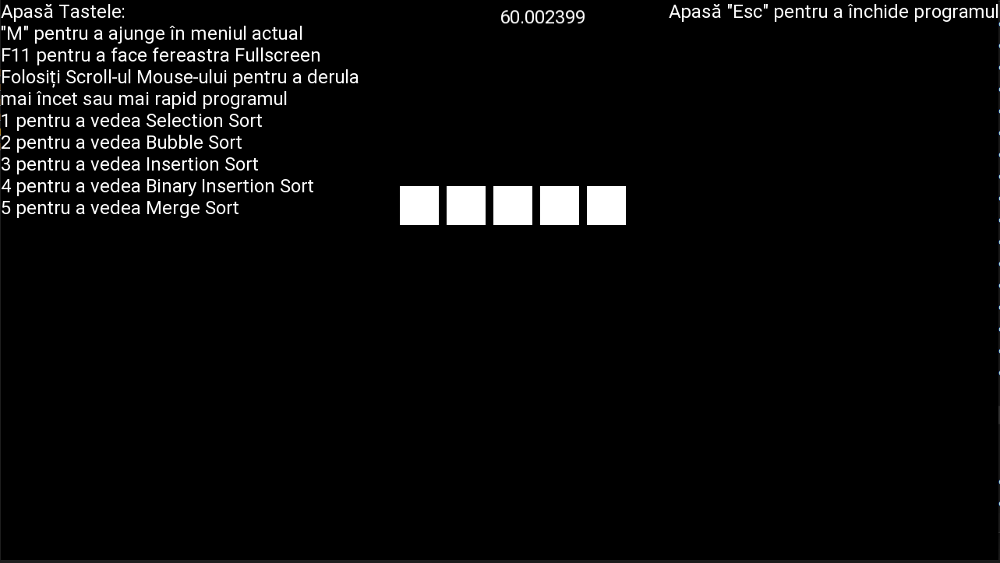
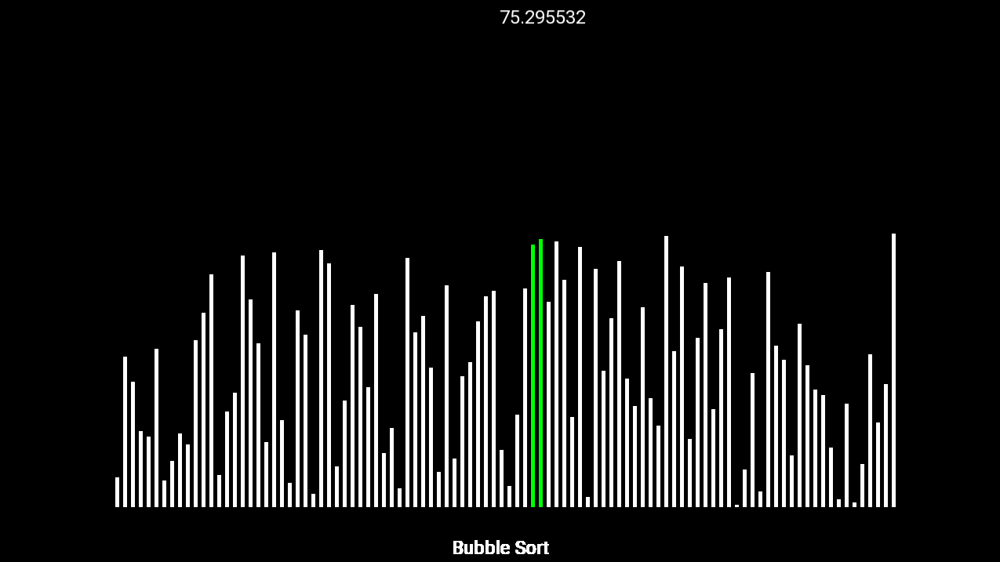
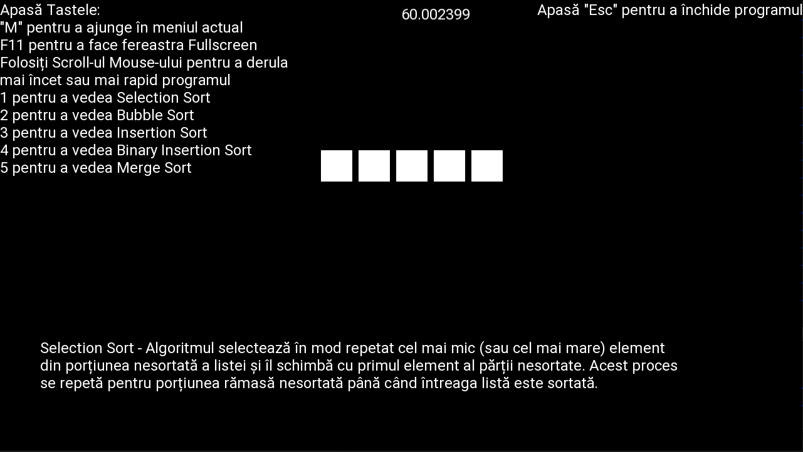
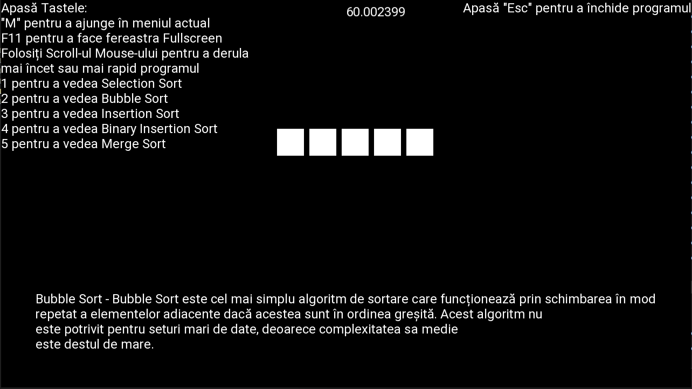
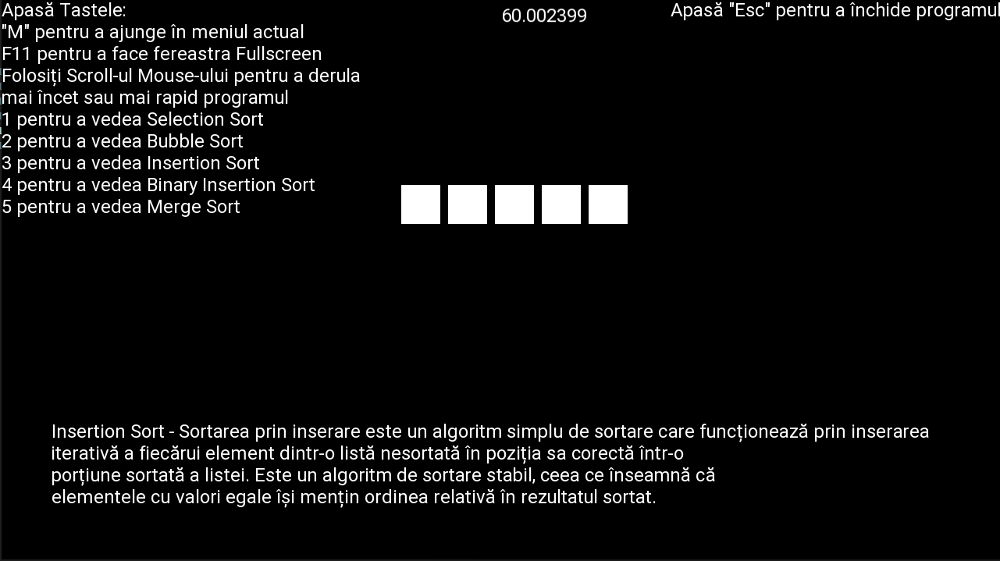
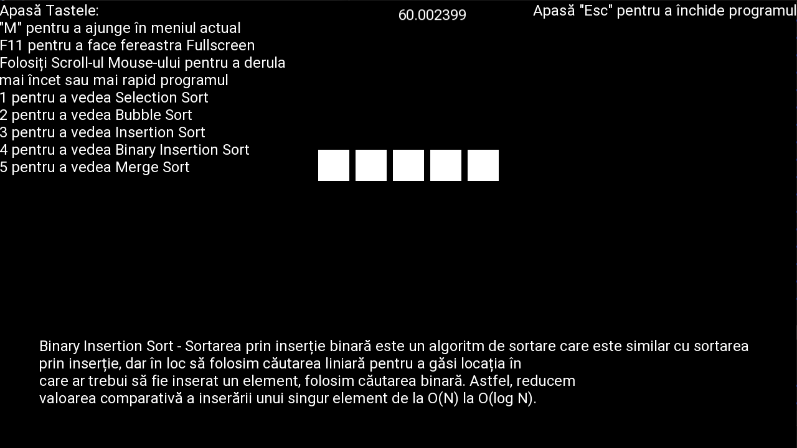

# VectorSorting
O scurtă reprezentare despre cum funcționează diferite tipuri de sortari de vectori folosind libraria SFML in C++.

---

<!-- 

 -->

---

## Scurte informatii legate de proiect

Proiectul a fost facut in 18/05/2024 pentru atestatul de clasa a 12-a. Am incercat in 19/08/2026 sa imbunatatesc partea de README si de acces/compilare a aplicatiei, astfel incat sa includa o scurta descriere legata de locatia tuturor dependintelor (intrucat in trecut am inclus toate librariile in root-ul repo-ului).  

Urmatorul pas este de a scapa de dependintele legate de windows, astfel incat sa fac proiectul disponibil si pe linux.

---

## Releases:

Versiunea compilata pentru windows:

[VectorSorting_v1.0.0](https://github.com/MrRaven07/VectorSorting/releases)

---

## Cerinte de sistem pentru compilare

Pentru a compila si rula acest proiect, sunt necesare urmatoarele:
- **C++ Compiler** : GCC/MinGW 
  - Pentru windows:
    - [WinLibs MSVCRT 13.1.0 (32-bit)](https://github.com/brechtsanders/winlibs_mingw/releases/download/13.1.0-16.0.5-11.0.0-msvcrt-r5/winlibs-i686-posix-dwarf-gcc-13.1.0-mingw-w64msvcrt-11.0.0-r5.7z)  
    SAU
    [WinLibs MSVCRT 13.1.0 (64-bit)](https://github.com/brechtsanders/winlibs_mingw/releases/download/13.1.0-16.0.5-11.0.0-msvcrt-r5/winlibs-x86_64-posix-seh-gcc-13.1.0-mingw-w64msvcrt-11.0.0-r5.7z)
    De pe site-ul oficial SFML pentru versiunea 2.6.2 https://www.sfml-dev.org/download/sfml/2.6.2/

- **SFML 2.x/SFML2.6.2** : (*Simple and Fast Multimedia Library*) Pentru partea de UI
  - Pentru windows:
    - [GCC 13.1.0 MinGW (DW2) - 32-bit](https://www.sfml-dev.org/files/SFML-2.6.2-windows-gcc-13.1.0-mingw-32-bit.zip)
    SAU
    - [GCC 13.1.0 MinGW (SEH) - 64-bit](https://www.sfml-dev.org/files/SFML-2.6.2-windows-gcc-13.1.0-mingw-64-bit.zip)
    De pe site-ul oficial SFML pentru versiunea 2.6.2 https://www.sfml-dev.org/download/sfml/2.6.2/

- **Make** / **Batch** : Pentru compilarea fisierelor
  - Pentru windows make (GNU make for windows): 
    https://sourceforge.net/projects/gnuwin32/files/make/3.81/ ; make-3.81.exe

Apoi compilatorul si libraria SFML pot sa fie dezarhivate si adaugate in root-ul proiectului intr-un director numit "compilerAndLibraries".
Urmand executarea `make` sau `build.bat`.

---

